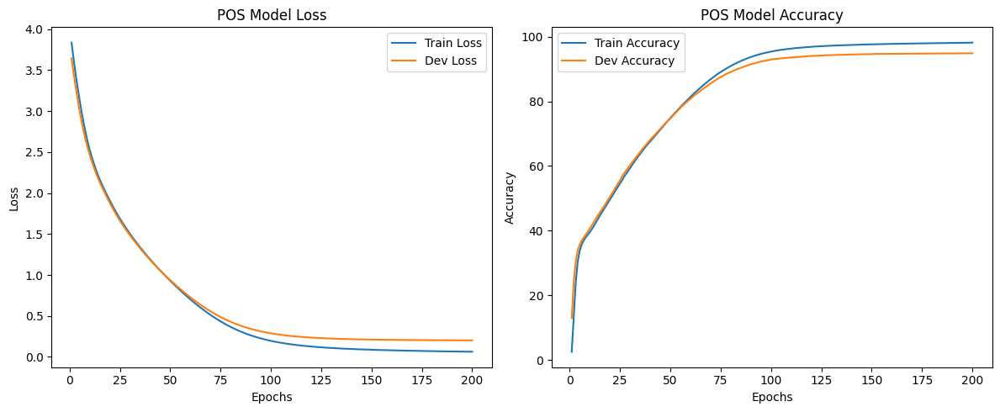
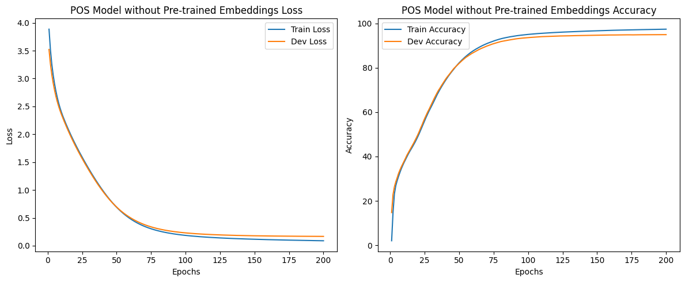

# Advanced Natural Language Processing Assignment


## Requirements

- Python 3.6 or higher
- PyTorch
- Matplotlib

## Files

- `taggerX.py`: Main scripts containing the implementation of the taggers.
- `pos/`: Directory containing the POS-tagging datasets.
  - `train`: Training data for POS-tagging.
  - `dev`: Development data for POS-tagging.
  - `test`: Test data for POS-tagging.
- `ner/`: Directory containing the NER datasets.
  - `train`: Training data for NER.
  - `dev`: Development data for NER.
  - `test`: Test data for NER.
- `test1.pos`: Predictions of the best POS model on the test set.
- `test1.ner`: Predictions of the best NER model on the test set.
- `part1.pdf`: Report detailing the best model configurations, considerations, and performance metrics.

## How to Run
make sure the pos and ner directory are in the same directory of the code 

1. Install the required packages:
   pip install torch matplotlib

2. to run :
 python taggerX.py


## Table of Contents
1. [Part 1: A Simple Window-Based Tagger](#part-1-a-simple-window-based-tagger)
2. [Part 2: External Word Embeddings](#part-2-external-word-embeddings)
3. [Part 3: Adding External Word Embeddings to the Tagger](#part-3-adding-external-word-embeddings-to-the-tagger)
4. [Part 4: Incorporating Sub-word Units in Tagging Tasks](#part-4-incorporating-sub-word-units-in-tagging-tasks)
5. [Part 5: Convolution-based Sub-word Units](#part-5-convolution-based-sub-word-units)


## Part 1: A Simple Window-Based Tagger

### 1. Introduction

This report describes the implementation of a simple window-based tagger for Part-of-Speech (POS) tagging and Named Entity Recognition (NER). The tagger uses a neural network approach with word embeddings and a single hidden layer.

### 2. Model Architecture

Our model uses the following architecture:

- Input: 5-word window (two words on each side of the target word)
- Embedding layer: 50-dimensional word embeddings
- Hidden layer: Fully connected layer with tanh activation
- Output layer: Fully connected layer with softmax activation
- Loss function: Cross-entropy loss

### 3. Data Handling

#### 3.1 Data Distribution

- POS Training set: 37,832 sentences
- POS Development set: 2,000 sentences
- POS Test set: 1,700 sentences
- NER Training set: 14,987 sentences
- NER Development set: 3,466 sentences
- NER Test set: 3,684 sentences

#### 3.2 Vocabulary

- A shared vocabulary is built from both POS and NER training data
- Special tokens: `<PAD>` for padding, `<UNK>` for unknown words
- Vocabulary size: 55,079

#### 3.3 Tag Sets

- Separate tag sets for POS and NER tasks
- POS tag set size: 45
- NER tag set size: 5

### 4. Model Implementation

The model is implemented as a PyTorch module named `WindowBasedTagger`:

```python
class WindowBasedTagger(nn.Module):
    def __init__(self, vocab_size, embedding_dim, window_size, hidden_dim, output_dim):
        super(WindowBasedTagger, self).__init__()
        self.embedding = nn.Embedding(vocab_size, embedding_dim)
        self.fc1 = nn.Linear(window_size * embedding_dim, hidden_dim)
        self.tanh = nn.Tanh()
        self.fc2 = nn.Linear(hidden_dim, output_dim)

    def forward(self, x):
        embeds = self.embedding(x).view((x.size(0), -1))
        hidden = self.tanh(self.fc1(embeds))
        output = self.fc2(hidden)
        return output
```

### 5. Training Process

The model is trained using the Adam optimizer. We collect training and development set metrics (loss and accuracy) for each epoch.

### 6. Hyperparameters and Best Models

We conducted extensive hyperparameter tuning, experimenting with various combinations of learning rates, hidden dimensions, and number of epochs. After evaluating the performance on the development set, we found the following configurations to yield the best results:

#### 6.1 POS Tagging

- Learning rate: 0.005
- Hidden dimension: 50
- Number of epochs: 200

#### 6.2 Named Entity Recognition (NER)

- Learning rate: 0.003
- Hidden dimension: 10
- Number of epochs: 150

### 7. Considerations and Solutions

#### 7.1 Unknown Words

Words not in the training vocabulary are mapped to the `<UNK>` token. The embedding for this token is learned during training and is used for any out-of-vocabulary words encountered in the dev or test sets.

#### 7.2 Sentence Boundaries

We use `<PAD>` tokens for words outside the sentence boundaries. This ensures a consistent 5-word input for our model, regardless of the word's position in the sentence.

#### 7.3 Words in Train Set but Not in Dev Set

For words that appear in the training set but not in the development set, we use the word's regular embedding from the embedding matrix. This allows the model to utilize the information it learned during training.

### 8. Results and Analysis

#### 8.1 POS Tagging


Epoch 200/200, Train Loss: 0.0639, Train Accuracy: 98.20%, Dev Loss: 0.2453, Dev Accuracy: 93.89%

#### 8.2 Named Entity Recognition


Epoch 150/150, Train Loss: 0.1997, Train Accuracy: 94.87%, Dev Loss: 0.2896, Dev Accuracy: 91.87%

Analysis:
When evaluating the NER tagger, we implemented a modified accuracy metric to address the class imbalance issue. Most words in NER tasks are assigned the 'O' (Outside) tag, which can lead to misleadingly high accuracy scores. A naive tagger that assigns 'O' to every word would achieve about 83% accuracy but would be useless in practice.

To get a more meaningful evaluation, we used the following approach:
1. We ignored all cases where both the correct tag and the predicted tag were 'O'.
2. We then computed the accuracy as the percentage of correctly tagged words among the remaining cases.

This modified metric gives us a better representation of the model's performance on actual named entities. 

### 10. Running the Code

Required packages: PyTorch, NumPy, Matplotlib

To run the code:
1. Ensure all required data files are in the correct directories
2. Execute the script: `python tagger1.py`
3. The script will train both POS and NER models, display graphs, and save predictions in `test1.pos` and `test1.ner` files

## Part 2: External Word Embeddings

In this part of the assignment, we experimented with pre-trained word embeddings to explore word similarities based on cosine similarity. We implemented a function `most_similar(word, k)` that returns the k most similar words to a given word according to the cosine similarity metric.

### Implementation Details

We loaded pre-trained word embeddings from "wordVectors.txt" and the corresponding vocabulary from "vocab.txt". We then created a dictionary mapping words to their vector representations.

The cosine similarity between two vectors u and v is calculated as:

sim(u,v) = (u · v) / (√(u · u) * √(v · v))

where · denotes the dot product.

### Results

We computed the 5 most similar words for the following words: dog, england, john, explode, and office. Here are the results:

1. dog
   - cat: 0.7709
   - rabbit: 0.7320
   - puppy: 0.6966
   - frog: 0.6485
   - kitten: 0.6349

2. england
   - ireland: 0.9009
   - scotland: 0.8501
   - australia: 0.8063
   - wales: 0.7983
   - europe: 0.7753

3. john
   - george: 0.9220
   - robert: 0.8988
   - charles: 0.8947
   - william: 0.8894
   - james: 0.8783

4. explode
   - grenadiers: 0.5554
   - slashed: 0.5508
   - appendix: 0.5339
   - monnet: 0.5242
   - instantaneously: 0.5183

5. office
   - board: 0.6682
   - court: 0.6198
   - offices: 0.6174
   - commission: 0.6167
   - authority: 0.6033

### Analysis

1. dog: The similar words are mostly other animals, particularly other pets. This suggests that the embeddings have captured semantic relationships between different types of animals.

2. england: The similar words are other countries, particularly those geographically or culturally close to England. This demonstrates that the embeddings have learned geographical and cultural associations.

3. john: The similar words are all common male first names. This indicates that the embeddings have grouped personal names together, particularly those of the same gender.

4. explode: The similar words for "explode" are somewhat varied and less intuitive. This could be due to the complex and varied contexts in which the word "explode" is used, or it might indicate that this particular word's embedding is less well-defined in the pre-trained set.

5. office: The similar words relate to various types of official or administrative entities. This shows that the embeddings have captured the professional and administrative connotations of the word "office".

These results demonstrate that the pre-trained word embeddings have successfully captured various semantic relationships between words, including categories (animals), geographical associations, personal names, and professional contexts. However, for some words like "explode", the relationships are less clear, highlighting the challenges and complexities in representing all words effectively in a shared vector space.

## Part 3: Adding External Word Embeddings to the Tagger

### 1. Introduction

In this part, we modified our tagger to incorporate pre-trained word embeddings. The goal was to evaluate whether using these embeddings would improve the performance of our Part-of-Speech (POS) and Named Entity Recognition (NER) taggers.

### 2. Implementation Details

#### 2.1 Loading Pre-trained Embeddings

We loaded pre-trained embeddings from two files:
- "wordVectors.txt": Contains the embedding vectors
- "vocab.txt": Contains the corresponding vocabulary words

```python
vectors = np.loadtxt("wordVectors.txt")
with open("vocab.txt", "r") as f:
    vocab = [line.strip() for line in f]
word_to_vec = {word: vector for word, vector in zip(vocab, vectors)}
```

#### 2.2 Handling Vocabulary

We modified our `build_vocab` function to incorporate both pre-trained vocabulary and words from our training data:

```python
def build_vocab(sentences, pre_trained_vocab):
    word_to_index = {'<PAD>': 0, '<UNK>': 1}
    index_to_word = {0: '<PAD>', 1: '<UNK>'}
    for word in pre_trained_vocab:
        if word not in word_to_index:
            idx = len(word_to_index)
            word_to_index[word] = idx
            index_to_word[idx] = word
    return word_to_index, index_to_word
```

#### 2.3 Model Architecture

We updated our `WindowBasedTagger` class to use pre-trained embeddings:

```python
class WindowBasedTagger(nn.Module):
    def __init__(self, vocab_size, embedding_dim, window_size, hidden_dim, output_dim, pre_trained_embeddings):
        super(WindowBasedTagger, self).__init__()
        self.embedding = nn.Embedding.from_pretrained(torch.FloatTensor(pre_trained_embeddings), freeze=False)
        self.fc1 = nn.Linear(window_size * embedding_dim, hidden_dim)
        self.tanh = nn.Tanh()
        self.fc2 = nn.Linear(hidden_dim, output_dim)
```

#### 2.4 Handling Out-of-Vocabulary Words

For words not in the pre-trained vocabulary, we used the <UNK> token and initialized their embeddings randomly:

```python
pre_trained_embeddings = np.zeros((len(word_to_index), embedding_dim))
for word, idx in word_to_index.items():
    if word in word_to_vec:
        pre_trained_embeddings[idx] = word_to_vec[word]
    else:
        pre_trained_embeddings[idx] = np.random.uniform(-0.25, 0.25, embedding_dim)
```

#### 2.5 Handling Case Sensitivity

We addressed the case sensitivity issue by converting all input words to lowercase before looking them up in the vocabulary:

```python
sentence_indices = [word_to_index.get(word.lower(), word_to_index['<UNK>']) for word in sentence]
```

This ensures that capitalized words in the input data match the lowercase words in the pre-trained vocabulary.

### 3. Training Process

#### 3.1 Data Preparation

We prepared the data using a sliding window approach, with a window size of 5 words.

#### 3.2 Training Parameters

- Window size: 5

#### 3.3 Best Model Parameters

##### POS Tagger:
- Learning rate: 0.005
- Hidden dimension: 50
- Number of epochs: 200

##### NER Tagger:
- Learning rate: 0.003
- Hidden dimension: 10
- Number of epochs: 150

### 4. Results and Analysis

After addressing the case sensitivity issue, we observed significant improvements in both POS tagging and Named Entity Recognition tasks when using pre-trained embeddings.

#### 4.1 POS Tagger Performance

| Model | Train Accuracy | Dev Accuracy |
|-------|----------------|--------------|
| Without pre-trained | 98.20% | 93.89% |
| With pre-trained    | 97.82% | 94.58% |


The POS tagger with pre-trained embeddings showed an improvement of 0.69 percentage points in dev set accuracy. While the training accuracy is slightly lower, the improved dev set performance suggests better generalization.

#### 4.2 NER Tagger Performance

| Model | Train Accuracy | Dev Accuracy |
|-------|----------------|--------------|
| Without pre-trained | 94.87% | 91.87% |
| With pre-trained    | 97.23% | 94.55% |


The NER tagger demonstrated a more substantial improvement, with a 2.68 percentage point increase in dev set accuracy. The model also showed higher training accuracy, indicating that the pre-trained embeddings provided valuable semantic information for this task.

#### 4.3 Analysis of Improvements

1. POS Tagging: The modest improvement in POS tagging accuracy suggests that the pre-trained embeddings provide some additional syntactic information. The slightly lower training accuracy but higher dev accuracy indicates better generalization, possibly due to the rich linguistic knowledge encoded in the pre-trained embeddings.

2. NER: The significant improvement in NER performance highlights the value of pre-trained embeddings for semantic tasks. The embeddings likely capture meaningful representations of entities and their contexts, leading to better recognition of named entities.

3. Generalization: In both tasks, the models with pre-trained embeddings show better dev set performance, indicating improved generalization. This suggests that the pre-trained embeddings help the model learn more robust features that transfer well to unseen data.

4. Learning Efficiency: The NER model with pre-trained embeddings achieved higher accuracy in both training and dev sets, suggesting that it learned more efficiently and effectively from the available data.

## Part 4: Incorporating Sub-word Units in Tagging Tasks

### 4.1 Implementation of Sub-word Units

To incorporate sub-word information into our tagger, we implemented the following approach:

1. For each word, we extracted:
   - A prefix of 3 letters
   - A suffix of 3 letters

2. We created separate embedding vectors for:
   - Words
   - Prefixes (3 letters)
   - Suffixes (3 letters)

3. Each word was then represented as the sum of:
   - The word vector
   - The prefix vector
   - The suffix vector

This method allows the model to capture morphological information, potentially improving performance on rare or unseen words.

### 4.2 Model Architecture

Our WindowBasedTaggerWithAffixes model architecture:

```python
class WindowBasedTaggerWithAffixes(nn.Module):
    def __init__(self, vocab_size, prefix_size, suffix_size, embedding_dim, window_size, hidden_dim, output_dim, pre_trained_embeddings=None):
        super(WindowBasedTaggerWithAffixes, self).__init__()
        self.word_embedding = nn.Embedding(vocab_size, embedding_dim)
        if pre_trained_embeddings is not None:
            self.word_embedding.weight.data.copy_(torch.from_numpy(pre_trained_embeddings))
        self.prefix_embedding = nn.Embedding(prefix_size, embedding_dim)
        self.suffix_embedding = nn.Embedding(suffix_size, embedding_dim)
        self.fc1 = nn.Linear(window_size * embedding_dim, hidden_dim)
        self.tanh = nn.Tanh()
        self.fc2 = nn.Linear(hidden_dim, output_dim)

    def forward(self, words, prefixes, suffixes):
        word_embeds = self.word_embedding(words)
        prefix_embeds = self.prefix_embedding(prefixes)
        suffix_embeds = self.suffix_embedding(suffixes)
        combined_embeds = word_embeds + prefix_embeds + suffix_embeds
        embeds = combined_embeds.view((words.size(0), -1))
        hidden = self.tanh(self.fc1(embeds))
        output = self.fc2(hidden)
        return output
```

### 4.3 Best Model Parameters

#### 4.3.1 POS Tagging
- Learning rate: 0.005
- Hidden dimension: 50
- Number of epochs: 200




#### 4.3.2 Named Entity Recognition (NER)
- Learning rate: 0.003
- Hidden dimension: 10
- Number of epochs: 150


### 4.4 Results and Analysis

#### 4.4.1 Overall Performance

| Task | Model | Dev Accuracy |
|------|-------|--------------|
| POS  | With pre-trained    | 95.21% |
|      | Without pre-trained | 94.95% |
| NER  | With pre-trained    | 93.68% |
|      | Without pre-trained | 92.92% |

#### 4.4.2 Out-of-Vocabulary (OOV) Performance

| Task | Model | OOV Accuracy |
|------|-------|--------------|
| POS  | With pre-trained    | 86.74% |
|      | Without pre-trained | 87.67% |
| NER  | With pre-trained    | 88.52% |
|      | Without pre-trained | 89.75% |

### 4.5 Analysis

1. **Effectiveness of Sub-word Units**: The high OOV performance (>86% for POS, >88% for NER) demonstrates that sub-word units effectively capture morphological information, allowing the model to generalize to unseen words.

2. **Pre-trained Embeddings vs. Sub-word Units**:
   - Pre-trained embeddings slightly improve overall accuracy (0.26% for POS, 0.76% for NER).
   - Surprisingly, models without pre-trained embeddings perform marginally better on OOV words.
   - This suggests that sub-word units are more useful for handling unseen words, while pre-trained embeddings provide a small boost in overall performance.

3. **Complementary Contributions**:
   - The combination of pre-trained embeddings and sub-word units yields the best overall performance.
   - However, the improvements are modest, indicating that sub-word units alone capture much of the relevant information.

4. **Consistency Across Tasks**:
   - Both POS and NER tasks show similar trends: slight improvement with pre-trained embeddings for overall accuracy, but marginally better OOV performance without them.
   - The impact is more pronounced in NER, possibly because it benefits more from the semantic information in pre-trained embeddings.

5. **Possible Explanations**:
   - Sub-word units may force the model to learn more generalizable features, leading to better OOV performance.
   - Pre-trained embeddings might occasionally provide misleading information for OOV words, especially if from a different domain.

### 4.6 Conclusions

1. Sub-word units are highly effective for handling OOV words in both POS tagging and NER tasks.
2. Pre-trained embeddings offer a small but consistent improvement in overall accuracy.
3. The combination of sub-word units and pre-trained embeddings provides the best overall performance, but the gains from pre-trained embeddings are modest.
4. The similar trends across POS and NER tasks suggest that these findings may generalize to other sequence labeling tasks in NLP.

Future work could explore more sophisticated ways of combining pre-trained embeddings with sub-word information to potentially achieve both better overall accuracy and improved OOV performance.

## Part 5: Convolution-based Sub-word Units

### 1. Introduction

In this part, we implement a convolution-based method for sub-word units as described by Ma and Hovy (2016). This approach uses a character-level CNN to generate word representations, which are then combined with pre-trained word embeddings. We apply this method to both Part-of-Speech (POS) tagging and Named Entity Recognition (NER) tasks.

### 2. Implementation Details

#### 2.1 Architecture

We implemented a `WindowBasedTaggerWithCNN` model with the following components:

- **Word Embedding Layer**
- **Character-level CNN**
- **Two Fully Connected Layers** with tanh activation

The character-level CNN consists of:

- **Character Embedding Layer**
- **1D Convolutional Layer**
- **ReLU Activation**
- **Max Pooling**

#### 2.2 Hyperparameters

Initial settings:

- **Window Size:** 5
- **Character Embedding Dimension:** 45
- **Number of CNN Filters:** 45
- **Kernel Size:** 3
- **Word Embedding Dimension:** Same as pre-trained vectors
- **Hidden Layer Dimension:** 50

#### 2.3 Data Preparation

We prepared the data using a sliding window approach for both words and characters. The character-level data was padded to a maximum word length of 10 characters.

#### 2.4 Training

We used the Adam optimizer with a learning rate of 0.001 and trained for 5 epochs. We implemented gradient accumulation with 4 steps and used mixed precision training for efficiency.

### 3. Results and Analysis

#### 3.1 Performance Comparison

We experimented with different numbers of filters in the character-level CNN:

**15 filters:**

- **POS Tagging:**
  - Train Accuracy: 97.54%
  - Dev Accuracy: 96.46%

- **NER:**
  - Train Accuracy: 97.88%
  - Dev Accuracy: 95.44%

**30 filters:**

- **POS Tagging:**
  - Train Accuracy: 97.63%
  - Dev Accuracy: 96.62%

- **NER:**
  - Train Accuracy: 98.02%
  - Dev Accuracy: 96.73%

**45 filters:**

- **POS Tagging:**
  - Train Accuracy: 97.64%
  - Dev Accuracy: 96.70%

- **NER:**
  - Train Accuracy: 98.31%
  - Dev Accuracy: 97.19%

#### 3.2 Analysis

1. **Impact of Filter Number:**
   Increasing the number of filters generally improved performance for both tasks. The improvement was more significant when moving from 15 to 30 filters compared to 30 to 45 filters, suggesting diminishing returns with very high filter counts.

2. **POS vs. NER Performance:**
   The NER task consistently showed higher accuracies than POS tagging, possibly due to the nature of the tasks and the effectiveness of character-level features for entity recognition.

3. **Model Size:**
   With 45 filters, the POS model had 5,047,920 parameters, indicating a relatively large model that might be prone to overfitting on smaller datasets.

4. **Training Efficiency:**
   The implementation includes several optimizations like gradient accumulation, mixed precision training, and CuDNN benchmarking, which likely contributed to efficient training despite the model's size.

### Performance Graphs


*POS Tagging: Train and Dev Loss/Accuracy*


*NER: Train and Dev Loss/Accuracy*

### 4. Filter Analysis

#### Top 5 Filters for POS Tagging
- **Filter 0:** Captures patterns like B2T, B2U, BuT
- **Filter 1:** Captures patterns like iyC, ieC, DyC
- **Filter 2:** Captures patterns like TuW, Tu", TuT
- **Filter 3:** Captures patterns like o`y, e`y, s`y
- **Filter 4:** Captures patterns like sXL, sXC, s`L

#### Top 5 Filters for NER
- **Filter 0:** Captures patterns like J}}, J-}, J}a
- **Filter 1:** Captures patterns like UwK, UwX, UFK
- **Filter 2:** Captures patterns like /OP, /cP, /@P
- **Filter 3:** Captures patterns like IH}, I]}, `H}
- **Filter 4:** Captures patterns like IDF, .DF, ZDF

The filter analysis reveals that different filters capture different character-level patterns such as:
1. **Filters that activate on specific character n-grams.**
2. **Filters sensitive to capitalization** (especially important for NER).
3. **Filters that detect affixes** (prefixes/suffixes) which could be particularly useful for POS tagging.

### 5. Conclusion

The CNN-based sub-word unit approach shows strong performance on both POS tagging and NER tasks. The method benefits from increasing the number of filters, with 45 filters providing the best results among the tested configurations. The character-level CNN appears to capture useful sub-word information, complementing the pre-trained word embeddings effectively.

#### Future Work

1. More extensive hyperparameter tuning (e.g., different kernel sizes, deeper architectures).
2. Detailed analysis of learned filters to gain linguistic insights.
3. Comparison with other sub-word approaches like BPE or WordPiece.
4. Exploration of more recent architectures like Transformers for these tasks.

### 6. References

- Ma, X., & Hovy, E. (2016). End-to-end Sequence Labeling via Bi-directional LSTM-CNNs-CRF. Proceedings of the 54th Annual Meeting of the Association for Computational Linguistics (Volume 1: Long Papers).
```


